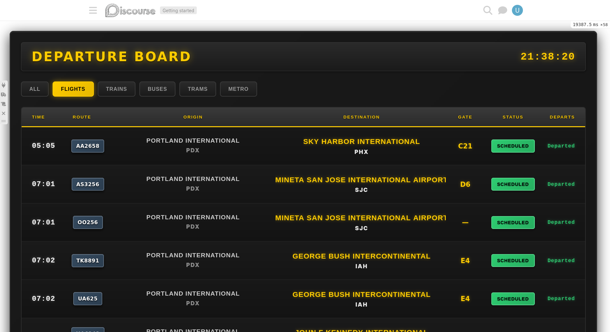
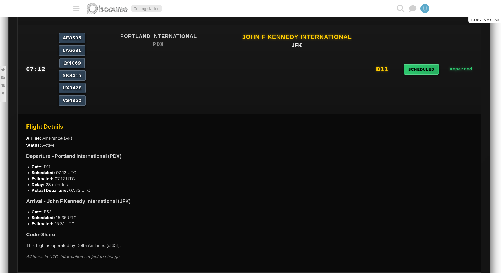
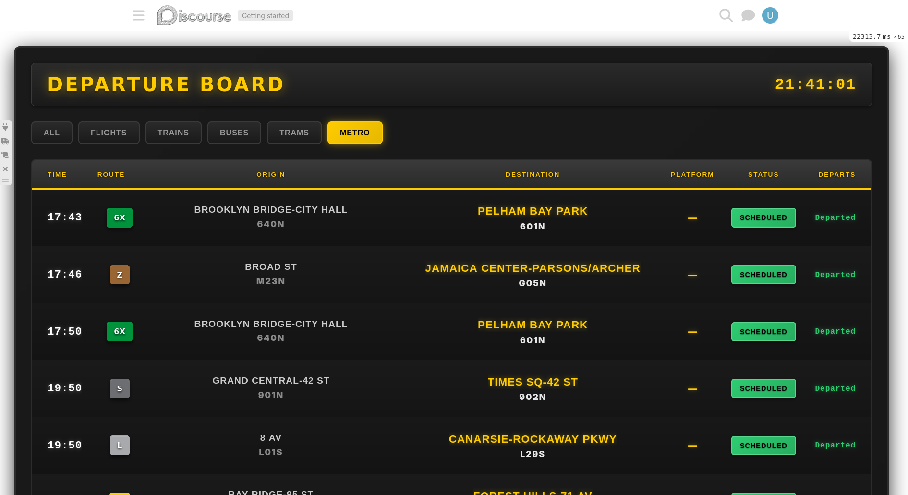
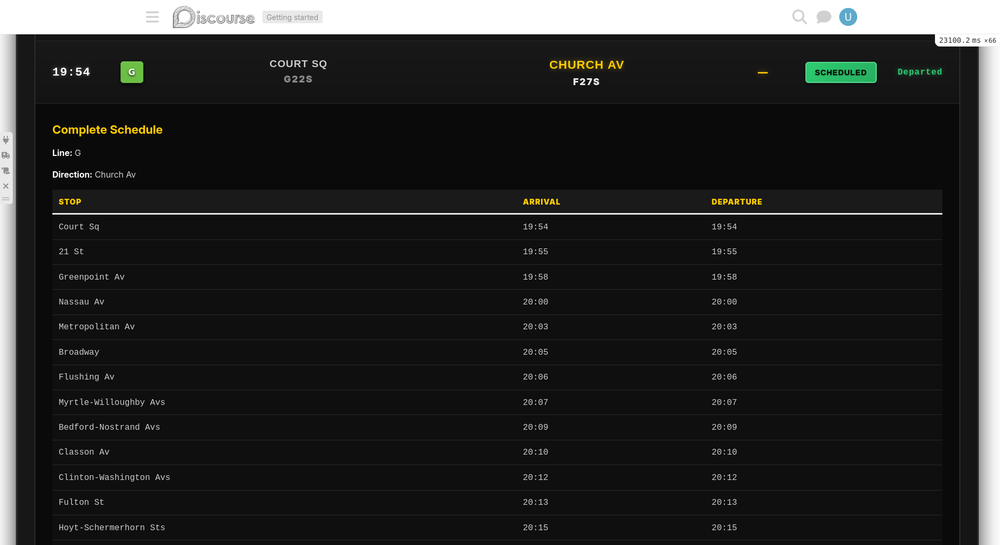
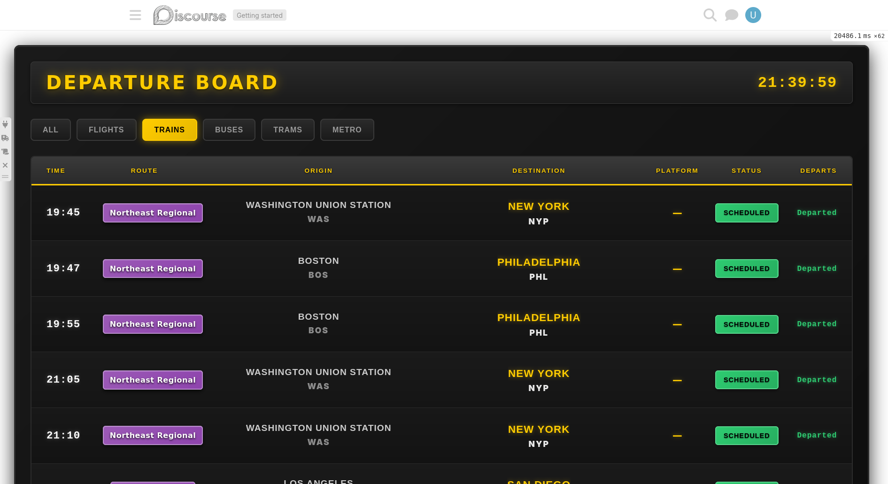
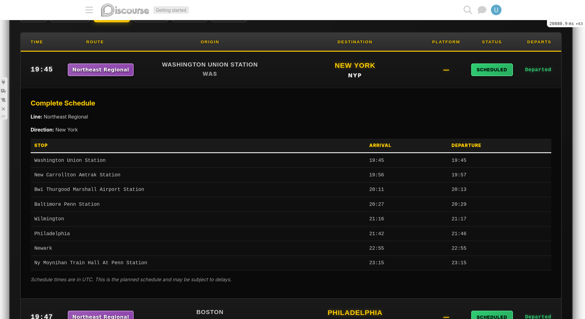

# Discourse Transit Tracker

A Discourse plugin that transforms your forum into a live departure board for tracking planes, trains, and public transit. Think airport/train station split-flap displays, but powered by Discourse topics.

## Why?

Discourse topics are surprisingly flexible containers for structured data. This plugin proves you can use them to store and display time-sensitive transit information with built-in update history, moderation tools, and a beautiful UI.

Is this practical for real transit tracking? Probably not. But it's a great example of pushing Discourse in unexpected directions to learn the platform deeply.

## Features

### Split-Flap Departure Board UI
- Classic airport/train station aesthetic with dark gradients and yellow text
- Real-time countdown timers updating every second
- Filter by mode: flights, trains, buses, trams, metro, or view all
- Status indicators: scheduled (green), delayed (orange pulse), departed (gray), canceled (red strikethrough)
- Responsive design: desktop grid layout, mobile stacked layout

### Expandable Schedule Details
Click any departure to expand and see:
- Complete stop-by-stop schedule with arrival/departure times
- Route and direction information
- All data rendered from Discourse posts (Post #2 contains the schedule table)
- Smooth accordion animation

### Topics as Departures
Each departure is a Discourse topic with:
- Custom fields for all timing, route, and location data
- Tags for mode (`flight`, `train`, `bus`) and status (`status:scheduled`, etc.)
- Post #1: Basic departure info
- Post #2: Complete schedule table (for multi-stop trips)
- Post #3+: Delay notifications and status updates

## Screenshots

<details>
<summary>transit-tracker-planes.png</summary>


</details>

<details>
<summary>transit-tracker-planes-expanded.png</summary>


</details>

<details>
<summary>transit-tracker-mta.png</summary>


</details>

<details>
<summary>transit-tracker-mta-expanded.png</summary>


</details>

<details>
<summary>transit-tracker-trains.png</summary>


</details>

<details>
<summary>transit-tracker-trains-expanded.png</summary>


</details>

### Multiple Data Sources

**Amtrak (GTFS)**:
- Downloads and parses Amtrak's GTFS feed
- Creates departure topics with detailed stop schedules
- Handles ~2,300 trips, creates ~600 topics (duplicates merged)
- Includes coordinates for every stop

**NYC MTA Subway (GTFS)**:
- Downloads and parses MTA's massive GTFS feed (500k+ stop times)
- Creates metro departure topics with complete schedules
- Official MTA line colors (red 1/2/3, green 4/5/6, yellow N/Q/R/W, etc.)
- 6-hour import window creates ~5,000 departure topics
- Per-route query optimization for fast filtering

**Flights (AviationStack API)**:
- Flight departure tracking
- Gate assignments and delay detection
- Code-share flight detection and merging
- Multiple airlines on same physical flight merged into one topic

## Installation

### 1. Add the plugin to your Discourse

```bash
cd /var/discourse
nano containers/app.yml
```

Add to the `hooks.after_code` section:

```yaml
hooks:
  after_code:
    - exec:
        cd: $home/plugins
        cmd:
          - git clone https://github.com/ducks/discourse-transit-tracker.git
```

Rebuild:

```bash
./launcher rebuild app
```

### 2. Run the setup task

```bash
cd /var/discourse
./launcher enter app
rake transit_tracker:setup
```

This creates:
- Three categories: Planes, Trains, Public Transit
- Tag groups for mode and status
- Updates plugin settings with category IDs

### 3. Enable the plugin

Go to `/admin/site_settings/category/plugins?filter=transit` and set:

- **transit_tracker_enabled**: `true`

### 4. Configure data sources

Choose one or more:

#### Option A: Amtrak GTFS (recommended for testing)

```bash
./launcher enter app
cd /var/www/discourse
RAILS_ENV=production bundle exec rake transit_tracker:import_amtrak
```

This downloads the latest Amtrak GTFS feed and creates ~600 departure topics with complete schedules. No API key required.

#### Option B: NYC MTA Subway GTFS

```bash
./launcher enter app
cd /var/www/discourse
RAILS_ENV=production bundle exec rake transit_tracker:import_mta
```

This downloads the MTA's GTFS feed and creates subway departure topics for the next 6 hours (~5,000 topics). Includes official line colors. No API key required.

**Note**: MTA GTFS is very large (500k+ stop times). The 6-hour window is intentional to avoid memory issues and topic overload.

#### Option C: Flights (AviationStack API)

Get an API key from [aviationstack.com](https://aviationstack.com/), then configure:

- **transit_tracker_aviationstack_api_key**: Your API key
- **transit_tracker_monitored_airports**: Comma-separated airport codes (e.g., `SFO,LAX`)

### 5. View the board

Navigate to `/board` to see your departure board in action.

## Routes

- **`/board`** - Full-screen departure board UI
- **`/board?mode=train`** - Filter by mode (train, flight, bus, tram, metro)
- **`/transit/board`** - JSON API endpoint for departure data
- **`/transit/proxy?ids=U297Z1P&minutesAfter=30`** - Proxy for Golemio API (optional, hides API token)

## Data Model

Each departure is stored as a topic with custom fields:

| Field | Description |
|-------|-------------|
| `transit_service_date` | Service date (YYYY-MM-DD) |
| `transit_trip_id` | Unique trip identifier (natural key) |
| `transit_route_short_name` | Route number/code |
| `transit_route_color` | Route color hex code (no #) for badge styling |
| `transit_headsign` | Destination name |
| `transit_origin` | Origin code (airport/station) |
| `transit_origin_name` | Origin full name |
| `transit_dest` | Destination code |
| `transit_dest_name` | Destination full name |
| `transit_dep_sched_at` | Scheduled departure (UTC) |
| `transit_dep_est_at` | Estimated departure (UTC) |
| `transit_arr_sched_at` | Scheduled arrival (UTC) |
| `transit_arr_est_at` | Estimated arrival (UTC) |
| `transit_platform` | Platform/track number |
| `transit_gate` | Gate number (flights) |
| `transit_terminal` | Terminal (flights) |
| `transit_vehicle_id` | Vehicle identifier |
| `transit_source` | Data source (amtrak, mta, aviationstack) |
| `transit_stops` | JSON array of stops with coordinates and times |

Tags:
- **Mode**: `flight`, `train`, `bus`, `tram`, `metro`
- **Status**: `status:scheduled`, `status:delayed`, `status:departed`, `status:canceled`

Posts:
- **Post #1**: Basic departure info (created with topic)
- **Post #2**: Complete schedule table (for multi-stop trips)
- **Post #3+**: Status updates, delay notifications

## How It Works

### Data Flow

1. **Data Import/Polling**:
   - Amtrak: One-time rake task downloads GTFS ZIP, parses CSVs
   - Golemio/AviationStack: Scheduled job polls APIs every N minutes

2. **Topic Creation/Update**:
   - Finds or creates topic using natural key (trip_id + service_date)
   - Updates custom fields with latest timing/route data
   - Creates schedule post (Post #2) with stop times table

3. **Status Detection**:
   - Compares scheduled vs estimated times
   - Detects delays (threshold configurable, default 2 minutes)
   - Updates tags: `status:scheduled` → `status:delayed` → `status:departed`

4. **Frontend Display**:
   - Board fetches `/transit/board` every 30 seconds
   - Renders rows with time, route, destination, gate, status, countdown
   - Client-side countdown updates every second (no API calls)
   - Click to expand → fetches and displays topic posts inline

### Code-Share Detection (Flights)

Multiple airlines can sell seats on the same physical flight. AviationStack provides a `codeshared` field identifying the operating carrier. The plugin uses the operating carrier's flight number as the natural key (trip_id), so marketing carriers automatically merge into the same topic.

Example: American operates flight AA 1234, but British Airways sells it as BA 5678 and Iberia as IB 789. All three point to the same trip_id, creating one topic with merged route codes: `AA 1234 / BA 5678 / IB 789`

### GTFS Parsing (Amtrak)

The `AmtrakGtfsService`:
1. Downloads `GTFS.zip` from Amtrak's CDN
2. Extracts and parses:
   - `routes.txt` - Route names and types
   - `stops.txt` - Station names, codes, coordinates
   - `trips.txt` - Trip IDs, routes, headsigns
   - `stop_times.txt` - Stop sequences and times
3. For each trip in the next 24 hours:
   - Creates topic with all timing/route data
   - Stores detailed stops array with lat/lon
   - Creates schedule post with markdown table

Edge cases handled:
- GTFS times can exceed 24 hours (e.g., "25:30:00" = 1:30 AM next day)
- Stop sequences aren't always sequential
- All times converted to UTC

### GTFS Parsing (MTA)

The `MtaGtfsService` follows the same pattern as Amtrak but handles a much larger dataset:

1. Downloads `google_transit.zip` from MTA's developer portal
2. Parses 500k+ stop_times rows (all trains, all stops, weeks ahead)
3. **6-hour import window** instead of 24 hours to avoid memory issues
4. Extracts `route_color` field for authentic MTA line colors
5. Creates ~5,000 departure topics with schedules

Performance optimizations for metro filtering:
- Per-route query limiting: Load 5 departures per route (~125 topics total)
- Smart refresh: Updates changed items in place, no full page reload
- Lazy post loading: Schedule rendered from stops JSON, not database posts

## Rake Tasks

```bash
# Setup: Create categories, tags, update settings
rake transit_tracker:setup

# Import Amtrak GTFS data
rake transit_tracker:import_amtrak

# Import NYC MTA Subway GTFS data
rake transit_tracker:import_mta

# Clean up old departed topics (optional)
rake transit_tracker:cleanup

# Reprocess existing topics to merge duplicates
rake transit_tracker:reprocess
```

## Development

### Running locally

```bash
# Start Discourse dev server
bin/ember-cli
bin/rails server

# Test Amtrak import
RAILS_ENV=development bundle exec rake transit_tracker:import_amtrak

# Test MTA import (creates ~5,000 topics)
RAILS_ENV=development bundle exec rake transit_tracker:import_mta

# Check board endpoint
curl http://localhost:3000/transit/board

# View board UI
open http://localhost:3000/board
```

### Testing services in Rails console

```ruby
# Test Amtrak GTFS
amtrak = AmtrakGtfsService.new
stats = amtrak.import
puts stats.inspect

# Test MTA GTFS
mta = MtaGtfsService.new
stats = mta.import
puts stats.inspect

# Test AviationStack
aviation = AviationstackService.new
flights = aviation.fetch_departures
puts flights.inspect
```

## Architecture Highlights

### Why Posts for Schedules?

Using Discourse posts instead of custom data structures provides:
- **Update history built-in** - Each delay/change is a new post
- **Moderation tools work** - Edit/delete bad data using Discourse UI
- **No additional tables** - Posts are just posts, Discourse handles storage
- **Comments possible** - Could allow users to reply to departures (infrastructure exists)

### CSS Grid with `display: contents`

The departure board uses a clever CSS Grid trick:
- `.transit-board` is a single grid with 6 columns
- `.board-row` uses `display: contents` to become transparent
- All cells become direct grid children
- Route column uses `auto` width → automatically sizes to widest badge across ALL rows
- No JavaScript needed for column width synchronization

## Use Cases Beyond Transit

This pattern (topics as structured time-sensitive data + posts as updates) could work for:
- **Package tracking** - Topics = packages, posts = scan events
- **Event schedules** - Topics = sessions, posts = time/room changes
- **Server status boards** - Topics = servers, posts = incidents
- **Release calendars** - Topics = releases, posts = changelogs
- **Deployment pipelines** - Topics = deploys, posts = stage completions
- **Support ticket boards** - Topics = tickets, expandable = full history

## Contributing

This is an experimental plugin built to explore Discourse's flexibility. Contributions welcome, especially:
- Additional transit API integrations
- Map UI showing vehicle positions
- Historical analytics and delay patterns
- Mobile app or widget versions
- Documentation improvements

## License

GPLv2 (same as Discourse)

## Acknowledgments

Built to learn Discourse plugin development by pushing the platform in an unconventional direction. Special thanks to the Discourse team for creating such a flexible and well-architected system.
